# Surveys

## Using Surveys

Surveys allow you to create a dynamic survey forms, create/modify survey structure, display and analyse survey results and save as PDF Document. With the survey editor it is possible to define conditional logic and answer validation for form fields.

The Survey editor can be accessed from the left side bar under surveys menu.

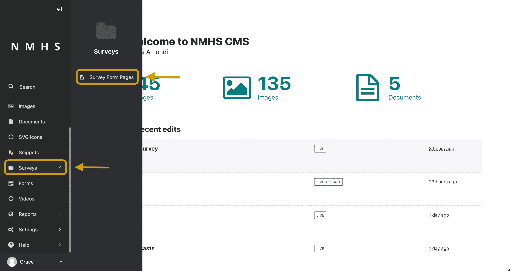

## Create Surveys and Panel Types

To create a survey, you will need to first add a **survey form page**. You can do this by clicking on the **Add survey from page** button at the top right corner of the of the page.

Select a parent page e.g 'Home' and continue to edit the page and supply a Page title. Publish this page. This page will render the form that will be created in the survey creator.

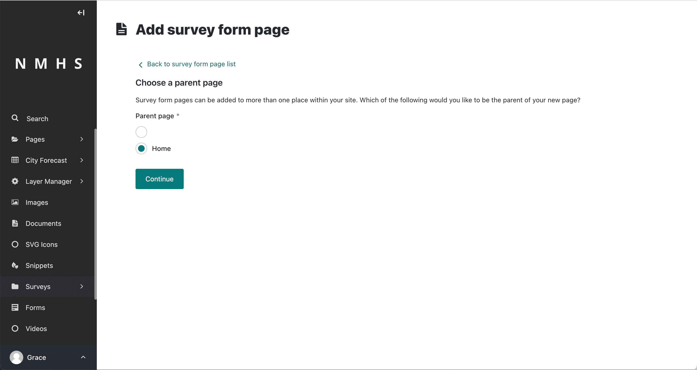

Navigate to the Survey creator to create form fields and their logic using the **Survey Creator** button.
|

## The Survey Creator

This section describes how to perfom basic tasks in the Survey Creator. There are currently two tabs in the creator i.e Designer and Preview tab.

### Designer Tab

By using the Designer tab, you have the ability to customize your survey. You can move questions and panels from the **Toolbox** onto the **Design Surface** through drag and drop, and modify the question, panel, and survey settings using the **Property Grid**.

#### Question and Panel Types

| Type      | Illustration | 
Image
 |
| -------- | ----- | ----------------------------------------------- |
|~~~~~~~~~~~|~~~~~~~~~~~~~~~|~~~~~~~~~~~~~~~~~~~~~~~~~~~~~~~~~~~~~~~~~~|
| **Single Input**  | For open-ended questions that necessitate brief responses, employ the Single Input type where respondents can input their answers using a single-line text editor. |        |
| **Checkbox**   | For questions that allow for multiple answers, utilize the Checkbox type where respondents can choose one or more options by clicking on the corresponding checkboxes. | 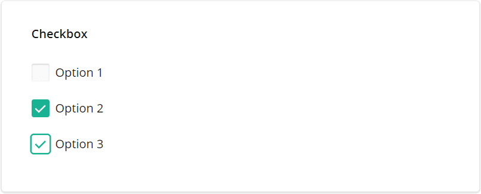       |
| **Radiogroup**   | For questions that offer several options but allow only one response, use the Radiogroup type where respondents can select a single answer by clicking on one of the radio buttons.  | 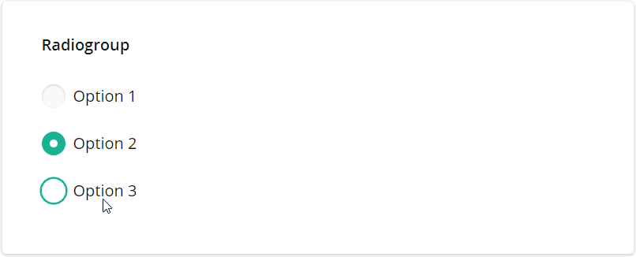       |
| **Dropdown**   | In the Dropdown type, respondents can choose a single answer from a list of options displayed in a drop-down menu. Similar to Radiogroup, this type is suitable for questions that have multiple options but require only one answer. The Dropdown UI can also show more options while using less screen space.  | 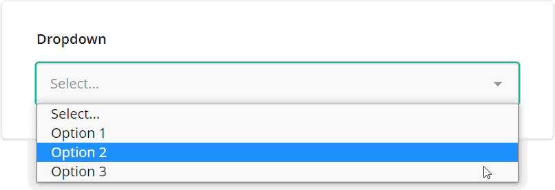       |
| **Comment**   | For open-ended questions that require respondents to provide lengthy answers, use the Comment type where respondents can input their responses in a resizable multi-line text area. This type is suitable for questions that accept multi-line answers. | 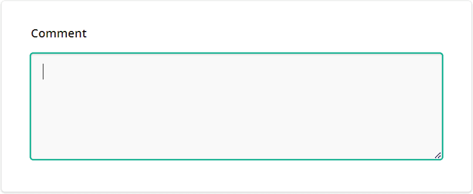       |
| **Rating**   | When you want respondents to provide a rating, use the Rating type where they can select a single number from within a specified range. This type is appropriate for questions that require a rating response.  |        |
| **Ranking**   | The Ranking type is suitable for questions where respondents need to establish the order of items. This type allows respondents to drag and drop items from a list to rearrange them based on rank or preference.  |        |
| **Image Picker**   | In a survey question where respondents are required to select one or several images or videos from a series, a value associated with the chosen image or video is saved to the survey results.  | 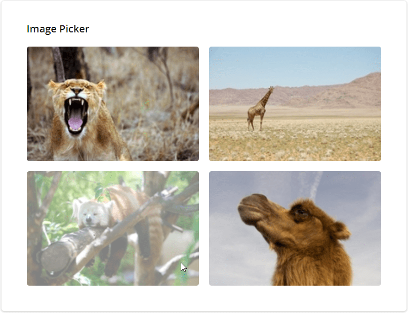 
| **Boolean**   | When using a Boolean editor, respondents can switch between Yes or No to provide their response. The survey results will record the response as true for Yes or false for No.  |        |
| **Signature Pad**   | To capture a respondent's signature or any other hand-drawn input, use a type that allows respondents to draw their signature using mouse or touch gestures within a designated input area.  | 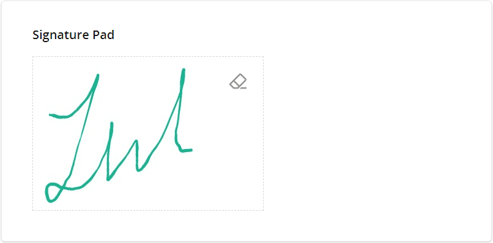       |
| **Image**   | The Image type is used to include an image or video in the survey for presentation purposes only. This type does not generate a value to be saved in the survey results. |
| **HTML**   | The HTML type can be used to format text, include links, and insert media or custom elements into the survey. This type is solely for presentation purposes and does not produce a value to be saved in the survey results. However, it is important to note that HTML content can be susceptible to security breaches. Therefore, make sure that any links inserted lead to trusted resources. |
| **Expression**   | The Expression type is used to calculate values and present them to respondents. It can be utilized to sum up scores of previous responses, display current date and time, find an average value, and so on. The calculated value is then saved in the survey results. In the example image provided, the Expression type concatenates the first and last names to display a full name. To define an expression in a survey question, type it into the Expression field found in the General category. Your expression can refer to other survey questions (such as {question1} + {question2}) or use pre-built calculation functions.  | 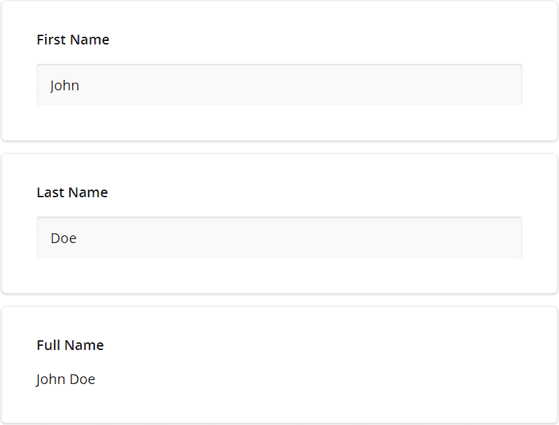       |
| **File**   | The File type is used to enable respondents to upload files. They can drag and drop one or several files into the designated area or select files using the browser's Upload File dialog window. Once uploaded, the files are saved in the survey results as base64-encoded strings.  | 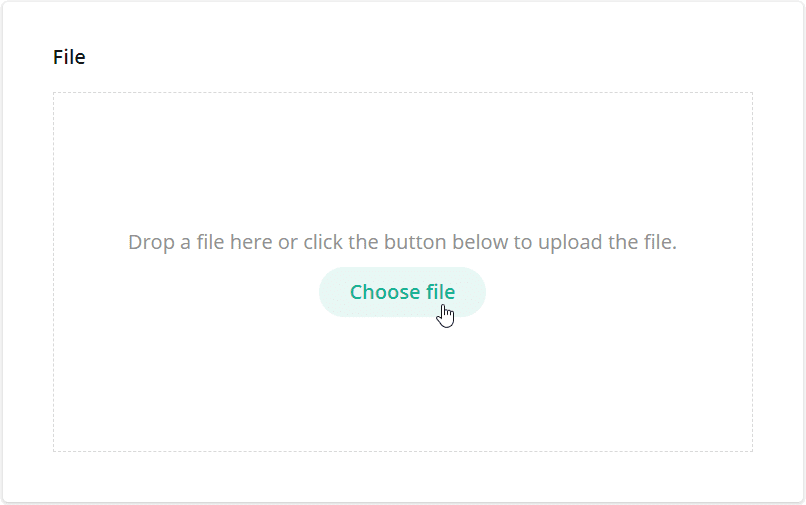       |
| **Single-Choice Matrix**   | The Single-Choice Matrix type exhibits radio buttons arranged in rows and columns. Respondents can choose only one radio button within each row.  | 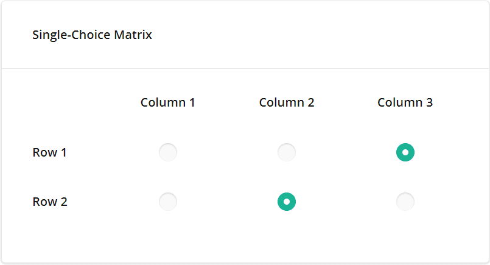       |
| **Multiple-Choice Matrix**   | The Multiple-Choice Matrix type displays rows and columns. Respondents use these editors to select a desired value in each cell. The following image illustrates the Multiple-Choice Matrix type with the default Dropdown editors. | 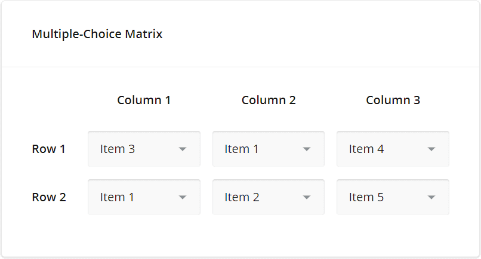       |
| **Dynamic Matrix**   | The Dynamic Matrix type is similar to a [Multiple-Choice Matrix](https://surveyjs.io/survey-creator/documentation/end-user-guide#multiple-choice-matrix), but respondents can add and remove matrix rows.  |        |
| **Multiple Text**   | Respondents enter their answers into multiple single-line text editors. Use the Multiple Text type for open-ended questions that require more than one short answer.  | 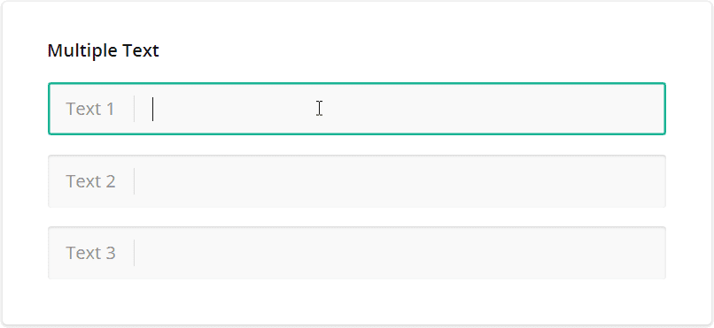       |
| **Panel**   | The Panel type is a container for other questions and panels. Use this type to group several questions or panels and control them all together.     |
| **Dynamic Panel**   | The Dynamic Panel type is a template panel that can contain multiple questions. Respondents can add and remove panels based on the template.  | 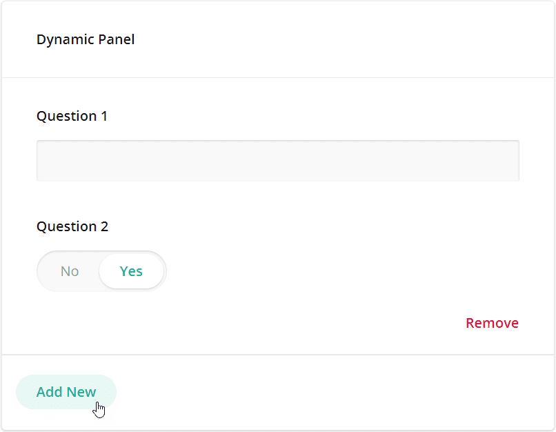       |

In progress...