# Managing Product Pages

Climweb separates the reusable definition of a product from the pages that visitors see. Define the product's structure
once in **Snippets**, create one public **Product Page**, and then add a dated **Product Item Page** whenever a new issue
is published.

## Understand the product structure

| Level | Managed in | Purpose | Example |
| --- | --- | --- | --- |
| Service Category | Snippets → Services | Groups related product pages on the products landing page and navigation | Weather Watch and Prediction |
| Product | Snippets → Products | Reusable definition of a product and its ingestion settings | Dekadal Climate Bulletin |
| Product Category | Inside a Product snippet | Groups the types of content displayed on an issue page | Bulletin, Weather Assessment |
| Product Item Type | Inside a Product Category | Identifies an individual map, document, GIF, or content section | Rainfall Amount, Bulletin PDF |
| Product Index Page | Pages | Top-level `/products/` landing page | Products |
| Product Page | Child of the Product Index Page | Public landing page containing all dated issues of one product | `/products/dekadal-climate-bulletin/` |
| Product Item Page | Child of a Product Page | One published issue containing one or more files/content blocks | Dekadal Climate Bulletin — 1 June 2026 |

```{important}
“Service Category” and “Product Category” are different. A service category groups product pages on the main products
listing. A product category groups item types inside one product issue.
```

The normal page hierarchy is:

```text
Home Page
└── Product Index Page
    ├── Product Page
    │   ├── Product Item Page (issue date 1)
    │   └── Product Item Page (issue date 2)
    └── Product Page
```

## Choose how the product will be populated

Before creating a product, choose one of the supported content workflows:

1. **Manual CMS publishing** — an editor uploads each issue through Wagtail.
2. **Folder auto-ingestion** — Climweb periodically scans a structured directory on the server.
3. **ACMAD external importer** — a registered importer discovers files from an HTML archive, THREDDS catalogue, or
   WordPress media API.

All three workflows publish the same Product and Product Item page types. Do not enable folder ingestion for a product
that is exclusively managed by an ACMAD external importer unless both sources and their deduplication behavior have been
reviewed.

## Create a product structure

### 1. Create or select a service category

In the Wagtail administration menu, open **Snippets → Services**.

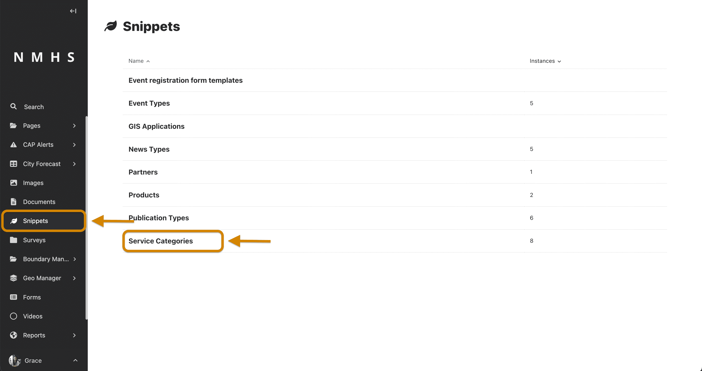

Reuse an existing service when it accurately describes the product. Otherwise, select **Add service**, enter a clear
name, choose an icon, and set its order.

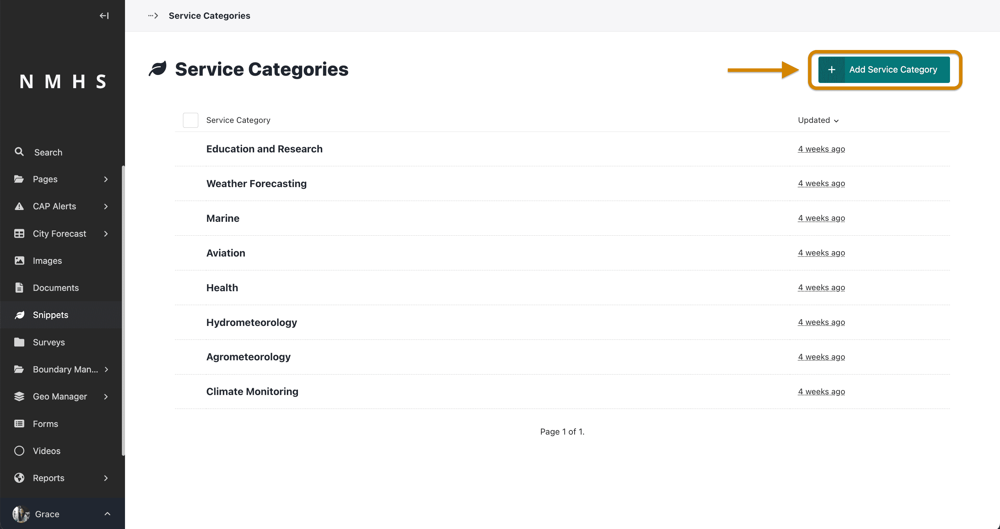

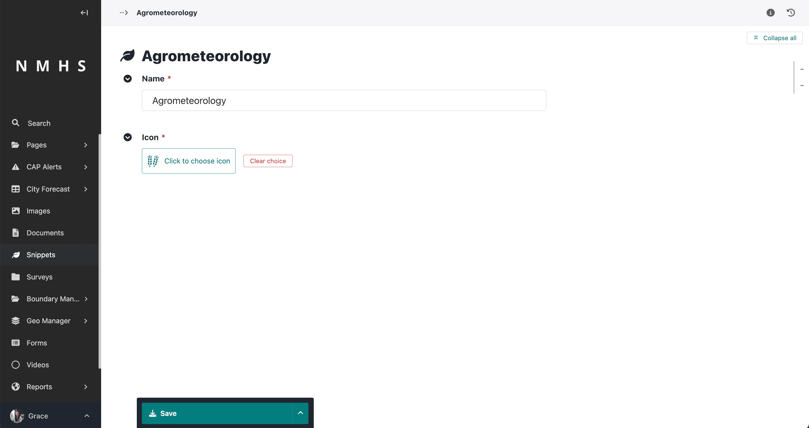

The service assigned as **Primary Service** determines where the product is grouped on the products landing page. A
product page can also be associated with other relevant services.

### 2. Create the reusable Product snippet

Open **Snippets → Products**, then select **Add product**.

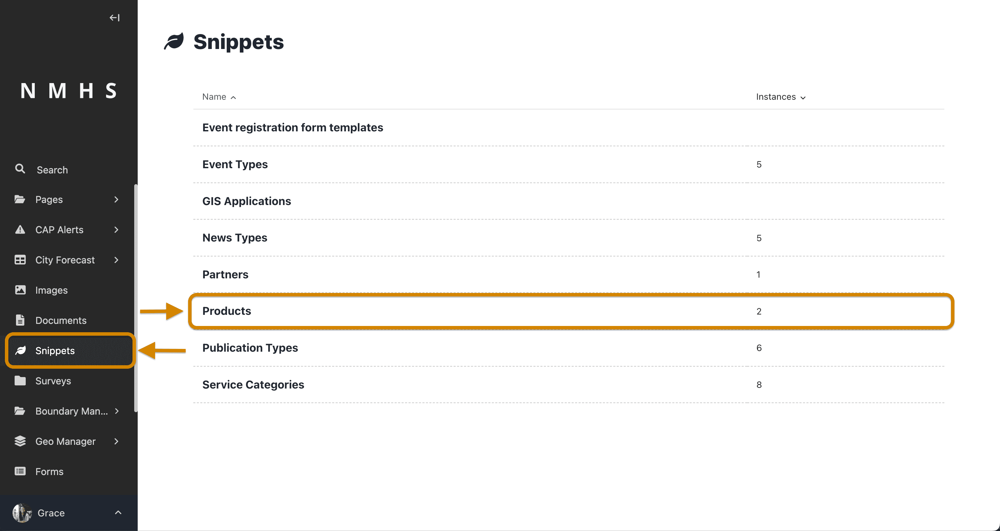

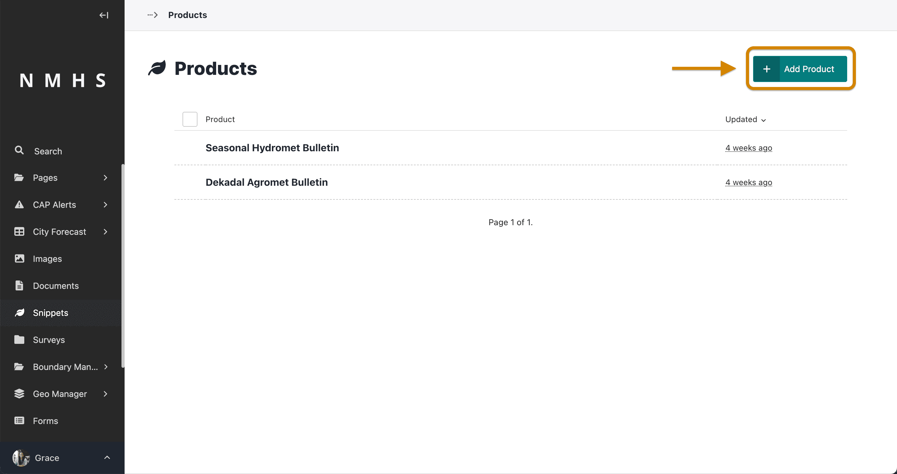

Enter a unique, visitor-friendly **Product Name**.

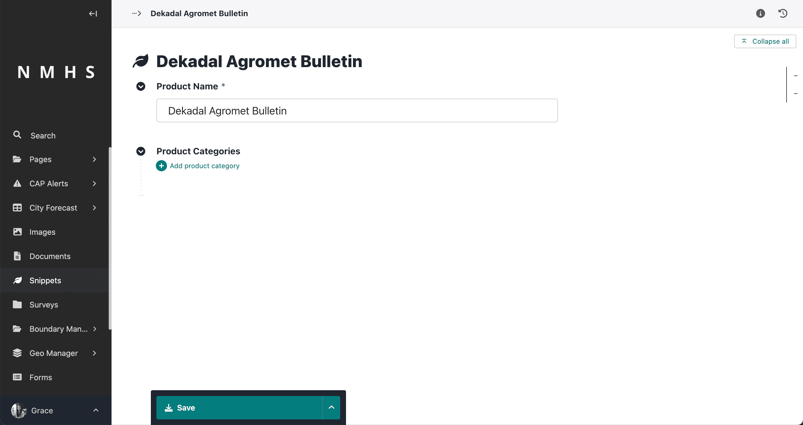

For a manually uploaded product, the name and its categories/item types are sufficient. The remaining fields control
folder auto-ingestion:

- **Enable Auto-Ingestion** — periodically scans the configured folder for new files.
- **Variable Name** — the product's folder name, for example `daily_forecast`.
- **Temporal Resolution** — yearly, monthly, weekly, daily, hourly, dekadal, or pentadal; it supplies the default
  filename date convention.
- **Watch Root Path** — directory containing the variable-name folder. A relative value is resolved from `MEDIA_ROOT`.

Leave auto-ingestion disabled and the folder fields blank when issues will be added manually or by an ACMAD external
importer.

### 3. Add product categories

Add one category for each logical group visitors should see in the issue-page sidebar. For example, a Dekadal Agromet
Bulletin might contain:

- Weather Assessment
- Agrometeorological Conditions and Agricultural Impact
- Bulletin

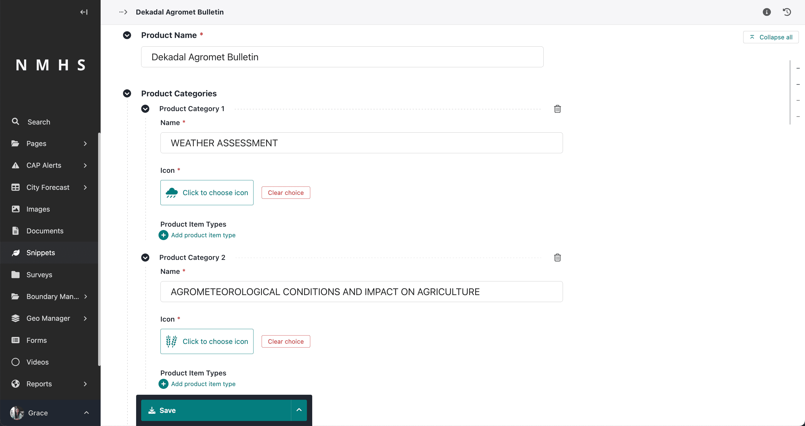

For every category, configure:

- **Name** — the public group label;
- **Icon** — displayed beside the category; and
- **File Format** — such as `png`, `jpg`, `pdf`, or `gif`. For folder ingestion, this is also the subfolder name.

Categories are reusable presentation/schema records; they are not separate Wagtail pages.

### 4. Add product item types

Inside each category, add the distinct content types expected for an issue. For example:

- Weather Assessment
  - Rainfall Amount
  - Rainfall Anomaly
  - Moisture Condition
- Agrometeorological Conditions and Agricultural Impact
  - Vegetation Condition and Agricultural Impact
- Bulletin
  - Bulletin PDF

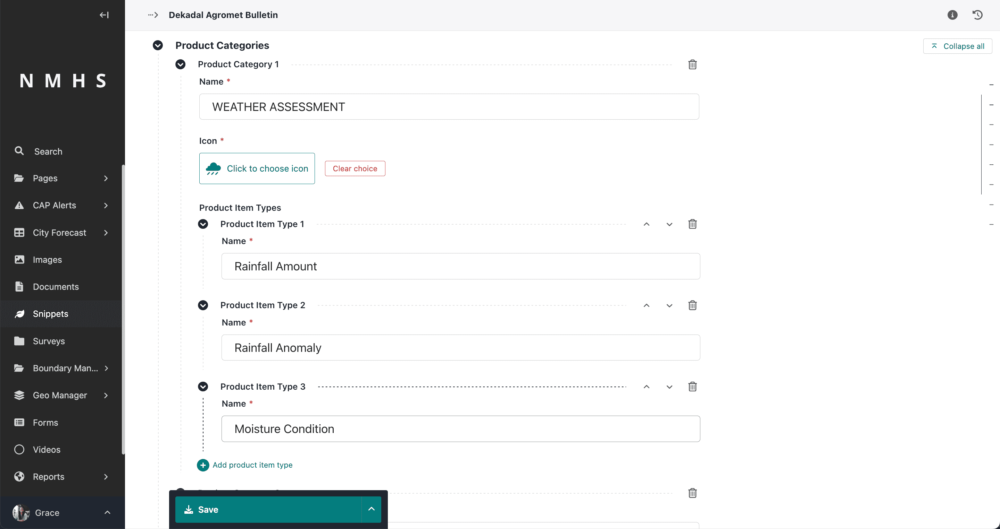

Give each item type a specific name and arrange item types in their intended public order. Avoid generic names such as
“Image” when several images appear in the same issue.

For folder ingestion, also configure:

- **Filename Convention** — filename without its extension. Supported tokens are `{yyyy}`, `{mm}`, `{dd}`, and
  `{hh}`. A prefix or suffix can be included, for example `rainfall_{yyyy}_{mm}_{dd}_00_00_00`.
- **Valid for (days)** — optional number of days after the issue date that the item remains effective.

If the filename convention is empty when an item type is saved, Climweb derives a default from the Product's temporal
resolution.

## Create the public Product Page

Open **Pages**, navigate to the **Products** page, choose its actions menu, and select **Add child page → National
Product Page**.

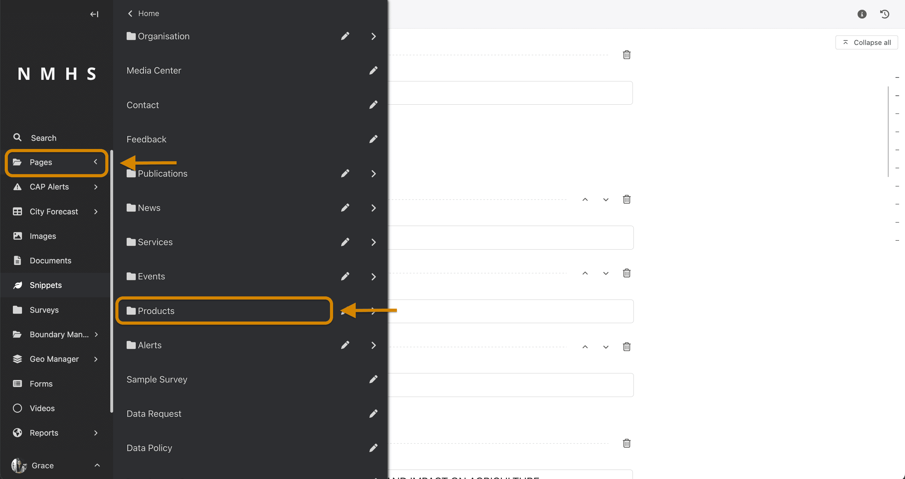

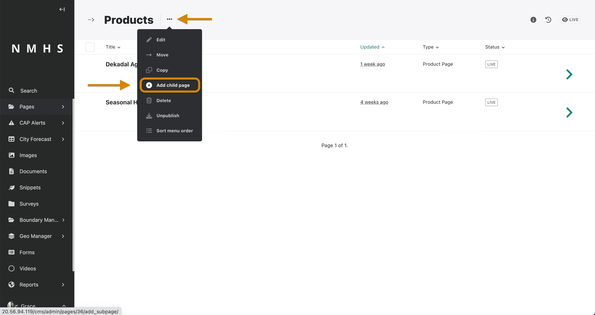

Complete the following fields:

- **Title** — public page heading and basis of the initial URL slug.
- **Primary Service** — determines the main products-page grouping.
- **Other relevant Services** — optional additional relationships.
- **Product** — choose the reusable Product snippet created earlier. A Product can be linked to only one national
  Product Page.
- **Introduction title, text, and image** — describe the product and provide its preferred listing image.
- **Products per page** — number of dated issues displayed per listing page; valid values are 6–20.
- **Default Listing Thumbnail** — fallback used when no introduction or issue image is available.
- **Menu Order** — lower values appear first among products.
- **Feature on homepage** — includes the product in the homepage Featured Products card.

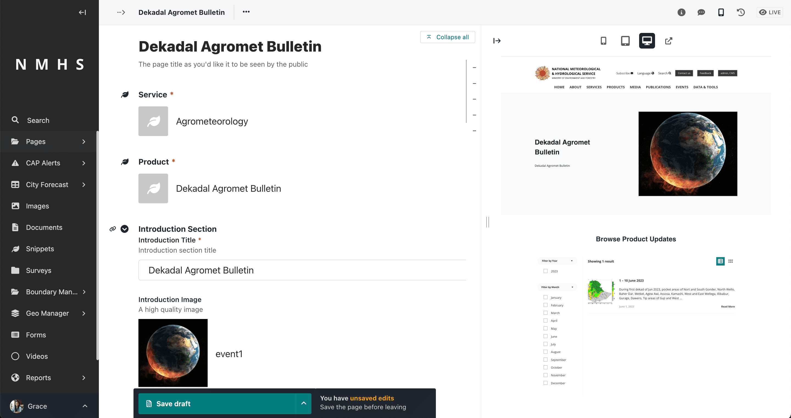

Use the **Promote** tab to review the slug, search title, and meta description. Keep the Product Page directly under the
Product Index Page so its public URL remains `/products/<product-slug>/`; do not include page-tree labels such as
`home-page` in a manually entered slug.

Preview the page and publish it. A product page with no published Product Item children is valid, but its public issue
listing will be empty.

## Publish a Product Item Page

(step-5-creation-of-one-or-more-product-items-for-a-product-page)=
### Add a dated issue

From the Product Page actions menu, select **Add child page → Product Item**.

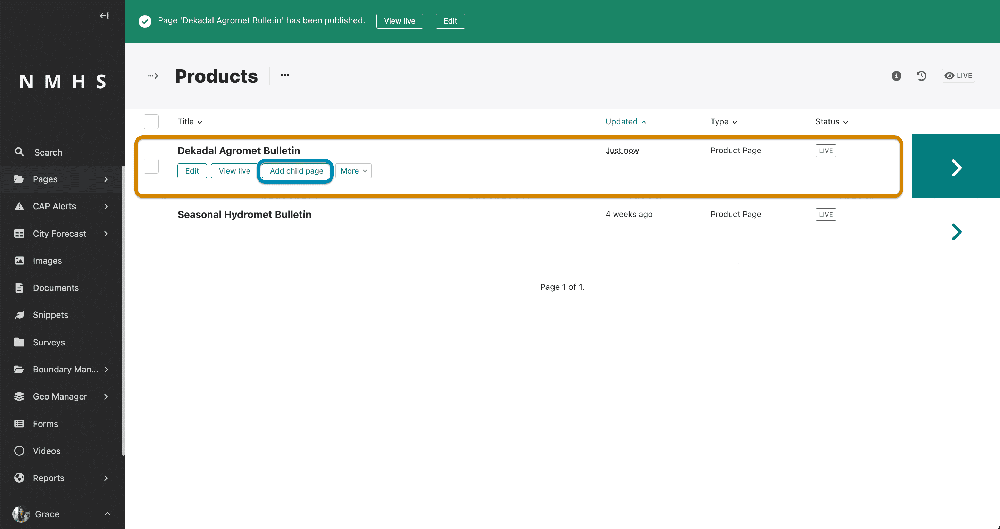

Enter:

- **Title** — identify the product and issue period clearly;
- **Effective from** — primary issue date used by year/month filters and sorting;
- **Effective until** — optional page-level validity end date; and
- **Products** — one or more product content blocks.

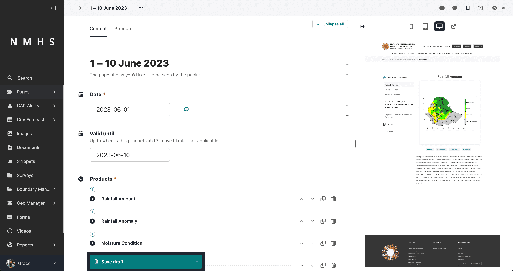

The available content blocks are:

| Block | Use for | Required asset/content |
| --- | --- | --- |
| Map/Image Product | Static maps, charts, and graphics | Wagtail image |
| GIF Product | Animated or static GIF products | Wagtail GIF image |
| Document/Bulletin Product | PDF bulletins and other downloadable documents | Wagtail document and optional thumbnail |
| Text/Tabular Product | Narrative interpretation and tables | Rich text and/or table blocks |

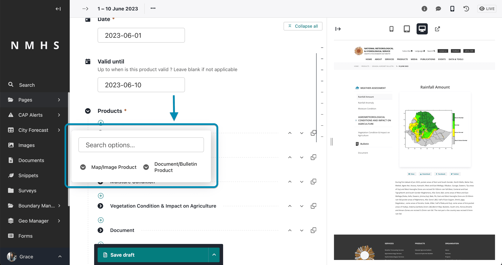

For each block:

1. Choose the **Product Type**. The choices come from the categories/item types of the parent Product.
2. Set the block's **Effective from** and optional **Effective until** dates.
3. Select or upload the asset, or enter the text/table content.
4. Add an optional description.

The effective-until date cannot be earlier than the effective-from date.

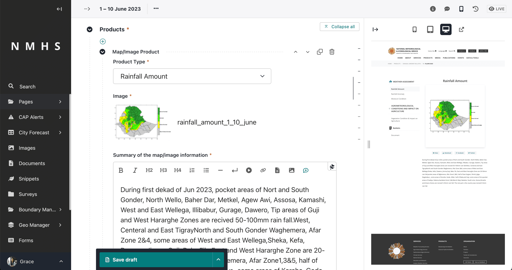

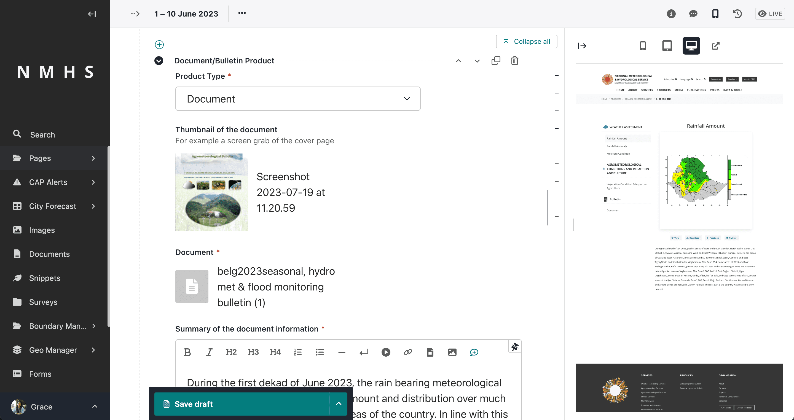

One issue page may contain multiple categories, item types, and dates. On the public issue page, categories and item types
become sidebar tabs; multiple entries for the same item type become date selectors.

Preview the complete issue before publishing. Only live Product Item pages appear on the Product Page.

```{note}
After the Product, categories, item types, and Product Page have been created, routine manual publishing begins at this
Product Item step. Do not create a new Product Page for every issue date.
```

## Manage thumbnails

For a Document/Bulletin block, enable **Auto-generate thumbnail** to generate an image from the first page of a PDF.

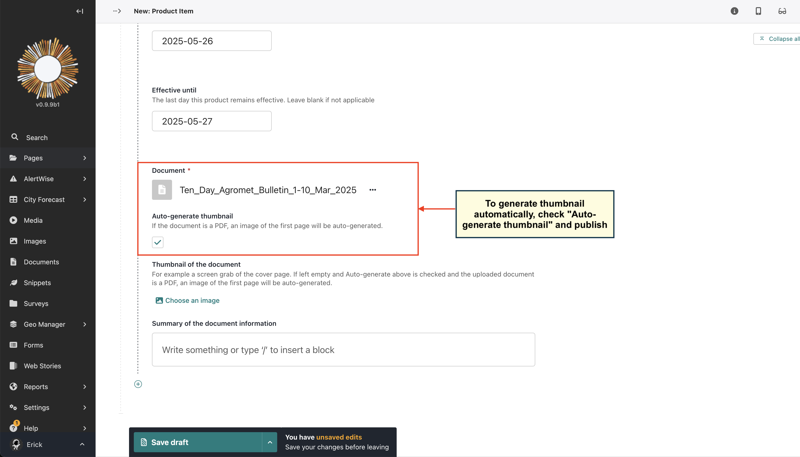

You can upload a custom thumbnail instead. Non-PDF documents require a manually selected thumbnail because first-page
generation is PDF-only.

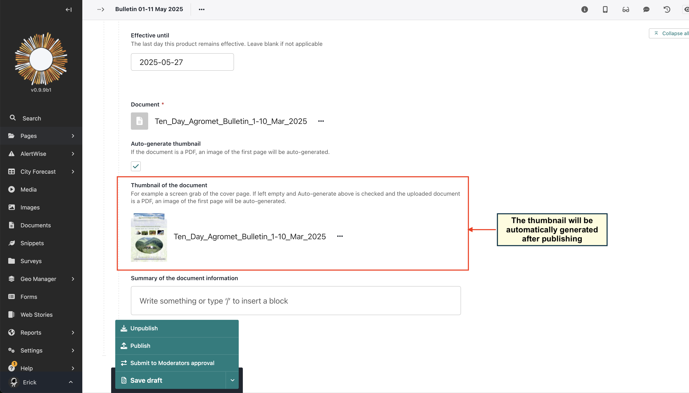

The Product Page card uses this fallback order:

1. Product Page introduction image
2. Latest published Product Item image, GIF, or document thumbnail
3. Product Page default listing thumbnail
4. Placeholder

If a new thumbnail does not immediately appear after publishing, clear the application/Wagtail cache or wait for the
configured cache lifetime.

## Find and organize published issues

Product Pages list live Product Item children newest-first according to their page-level **Effective from** date.
Visitors can filter the list by year and month and switch between grid and list views. The **Products per page** setting
controls pagination.

To correct the order, edit the Product Item's page-level date; changing only a date inside one content block does not
change the issue card's position in the parent listing.

Use **Menu Order** on Product Pages to control ordering on the Product Index. Service ordering is managed on the Service
snippet.

## Edit, unpublish, or replace an issue

- Edit a Product Item Page to correct metadata, replace a file, change a description, or add another content block.
- Publish a new revision for the changes to become public.
- Use **Unpublish** when an issue must be hidden but retained in Wagtail.
- Use page history to review or restore an earlier revision.
- Delete a page only when it should no longer be retained. Unpublishing is safer for temporary withdrawal.

When an issue was created by an external importer, replacing its content manually does not change its source provenance.
A later **Refresh existing** import may replace importer-managed assets, so permanent upstream corrections should be made
through the source or importer workflow.

## Configure MapViewer integration

A Product Page can expose a **MapViewer** tab when it has linked raster layers. From the Pages explorer, open the Product
Page actions and select **MapViewer Integration**. Associate each Geomanager raster layer with the corresponding Product
Item Type, save, and verify the map in preview.

MapViewer integration is optional and independent of uploaded images/documents. Products without layers display only
the normal Browse tab.

## Folder auto-ingestion

Folder ingestion is separate from the ACMAD external product importers. When enabled on a Product snippet, Climweb scans:

```text
<watch_root>/<variable_name>/<format>/<filename_convention>.<format>
```

For example:

```text
products/daily_rainfall/png/rainfall_2026_08_12_00_00_00.png
```

The scanner matches the configured convention, extracts the date/time, creates the appropriate Product Item Page,
uploads the file to Wagtail, and records the file path and modification time to prevent duplicate ingestion.

Requirements:

- the Product Page must already exist and be live;
- Variable Name, Watch Root Path, category format, and item-type filename conventions must agree with the directory;
- the application and Celery worker must be able to read the folder; and
- the file must use a supported image or document extension.

When auto-ingestion is enabled, a **Run Ingestion** action is available for the Product Page in the Pages explorer. A
scheduled Celery task also scans enabled products periodically.

## ACMAD externally imported products

The migrated ACMAD products use dedicated source-aware importers instead of the Product snippet's Watch Root Path. Their
Product snippets, categories, item types, Product Pages, issue pages, media, and provenance can be created automatically.

Use **Product Imports** in the Wagtail administration menu to:

- preview or run historical imports by date range;
- monitor live progress and recent output;
- stop a queued or running manual import;
- enable or disable each automatic importer;
- change its automatic interval; and
- test, preview, save, or restore its source/schema configuration.

See [ACMAD Product Migrations](../products/acmad-product-migrations.md) for the completed families, production seeding,
source configuration, and troubleshooting.

## Seasonal and Long-Range Forecast pages

Seasonal and Long-Range Forecasts is presented as a service/category grouping on the products listing. It contains five
normal Product Pages:

- Seasonal Forecast Maps
- Seasonal Outlook Bulletins
- Consensus Statements and Communiqués
- Recommendations and Summaries
- Technical Notes

Each type reuses the same Product Page template and receives dated Product Item children from the Seasonal importer.
They should remain direct descendants of the Product Index Page; the shared service assignment provides the visual
grouping without introducing an extra URL segment.

## Recommended editorial checklist

Before publishing a new or edited product issue, confirm that:

- the Product Page is linked to the intended Product and Primary Service;
- the Product snippet contains the required categories and item types;
- the issue title and page-level effective date are correct;
- every block uses the correct Product Type;
- validity dates are accurate;
- images have meaningful titles and documents have usable filenames;
- PDFs have a generated or custom thumbnail;
- the issue and its download/view links work in preview;
- the Product Page card has an appropriate thumbnail; and
- the page is published, not only saved as a draft.

## Troubleshooting

### A Product Type is missing from the issue form

The dropdown is generated from the Product selected on the parent Product Page. Add the missing item type to that
Product snippet, save it, and reopen the Product Item form. Also confirm that the parent page references the intended
Product.

### The product or issue returns 404

Confirm that the Product Page and Product Item Page are both published and that the Product Page is under the Product
Index Page. Check the slug in the Promote tab. If the page was moved, clear cached routes after publishing.

### The product page is empty

Confirm that it has live Product Item children and that their page-level dates are valid. Draft or unpublished children
are not included.

### The product appears under the wrong heading

Edit the Product Page's **Primary Service**. The Product's internal categories do not control grouping on the main
products landing page.

### A PDF has no thumbnail

Confirm that **Auto-generate thumbnail** was selected before publishing and that the uploaded document is a valid PDF.
Edit the block and select a custom image if generation is unavailable.

### Folder ingestion does not create issues

Confirm that ingestion is enabled, the Product Page is live, the worker can read the Watch Root Path, and the folder,
extension, and filename exactly match the Product, category, and item-type settings. Use **Run Ingestion** and inspect the
worker logs for the rejected path or convention.
